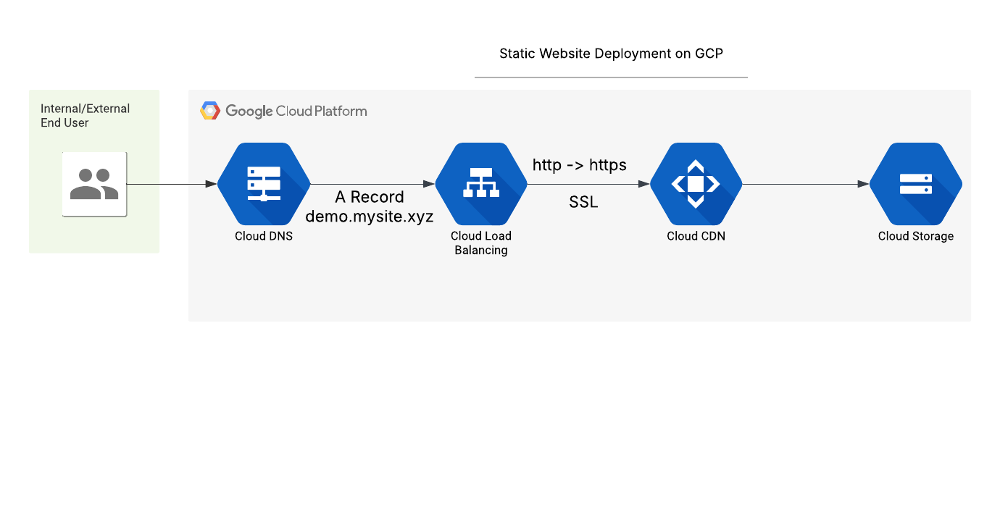

# gcp-terraform-cdn-simple-website
Static Website Deployment on Google Cloud Platform



### Explanation of Components
1. **User (Browser)**: The end-user accesses the website via a browser.
2. **Cloud DNS**: Resolves the domain name (`demo.mysite.xyz`) to the static IP address.
3. **Load Balancer**: Routes traffic to the appropriate backend and handles HTTP-to-HTTPS redirection.
4. **HTTPS Proxy**: Terminates HTTPS traffic using the managed SSL certificate.
5. **URL Map**: Maps the subdomain (`demo.mysite.xyz`) to the CDN backend.
6. **CDN Backend**: Serves content from the GCS bucket using Google Cloud CDN.
7. **GCS Bucket**: Stores static website files (`index.html` and `404.html`).
8. **Static Files**: The actual HTML files served to users.

---

## Prerequisites
Before using this Terraform configuration, ensure you have the following:

1. **GCP Account**: A Google Cloud Platform account with billing enabled.
2. **GCP Project**: A GCP project where resources will be deployed.
3. **Service Account Key**: A service account key with the necessary permissions. Save it as `service-account-key.json`.
4. **Terraform Installed**: Terraform CLI installed on your machine. Download it from [here](https://www.terraform.io/downloads.html).
5. **Custom Domain**: A registered domain name (e.g., `mysite.xyz`) hosted outside GCP (e.g., GoDaddy).

---

## Required IAM Roles

Ensure the service account used for Terraform (`terraform-gcp@<project-id>.iam.gserviceaccount.com`) has the following IAM roles assigned at the **project level**:

| IAM Role                        | Purpose                                                |
|----------------------------------|--------------------------------------------------------|
| `roles/storage.admin`            | Manage Cloud Storage buckets and objects              |
| `roles/dns.admin`                | Manage Cloud DNS zones and records                    |
| `roles/compute.networkAdmin`     | Manage load balancers, URL maps, and forwarding rules |
| `roles/compute.securityAdmin`    | Manage SSL certificates and HTTPS proxies             |

### Assigning IAM Roles

Use the `gcloud` CLI to assign each role:

```bash
gcloud projects add-iam-policy-binding <project-id> \
  --member="serviceAccount:terraform-gcp@<project-id>.iam.gserviceaccount.com" \
  --role="roles/storage.admin"

gcloud projects add-iam-policy-binding <project-id> \
  --member="serviceAccount:terraform-gcp@<project-id>.iam.gserviceaccount.com" \
  --role="roles/dns.admin"

gcloud projects add-iam-policy-binding <project-id> \
  --member="serviceAccount:terraform-gcp@<project-id>.iam.gserviceaccount.com" \
  --role="roles/compute.networkAdmin"

gcloud projects add-iam-policy-binding <project-id> \
  --member="serviceAccount:terraform-gcp@<project-id>.iam.gserviceaccount.com" \
  --role="roles/compute.securityAdmin"
```

## Manual Steps

### 1. Create a Public DNS Zone in Google Cloud DNS
Before running Terraform, you need to manually create a **public DNS zone** in Google Cloud DNS for your subdomain.

#### Steps:
1. Go to the [Google Cloud Console](https://console.cloud.google.com).
2. Navigate to **Network Services > Cloud DNS**.
3. Click **Create Zone**.
4. Configure the zone as follows:
   - **Zone type**: Public
   - **Zone name**: `terraform-gcp` (or any name you prefer)
   - **DNS name**: `demo.mysite.xyz` (replace with your subdomain)
5. Click **Create**.

#### Note:
- After creating the zone, Google Cloud DNS will provide **NS (Name Server) records** for the zone. You’ll need these in the next step.

---

### 2. Update NS Records in GoDaddy
Since your main domain (`mysite.xyz`) is hosted outside GCP (e.g., GoDaddy), you need to update the NS records for the subdomain (`demo.mysite.xyz`) to point to Google Cloud DNS.

#### Steps:
1. Log in to your GoDaddy account.
2. Navigate to the **DNS Management** section for your domain (`mysite.xyz`).
3. Add a new **NS record** for the subdomain (`demo.mysite.xyz`) with the NS records provided by Google Cloud DNS.
   - Example NS records:
     ```
     ns-cloud-a1.googledomains.com
     ns-cloud-a2.googledomains.com
     ns-cloud-a3.googledomains.com
     ns-cloud-a4.googledomains.com
     ```
4. Save the changes.

#### Note:
- DNS changes may take up to 24-48 hours to propagate globally.

---

## Variables
The following variables are required to deploy this infrastructure. Update them in `terraform.tfvars`:

| Variable          | Description                                      | Example Value               |
|-------------------|--------------------------------------------------|-----------------------------|
| `gcp_project_id`  | The GCP project ID where resources will be deployed. | `my-sandbox`            |                |
| `subdomain_name`  | The subdomain for the website.                   | `demo.mysite.xyz`           |
| `env`             | Environment name (e.g., demo, prod).             | `demo`                      |
| `gcp_region`      | The GCP region where resources will be deployed. | `us-west1`                  |
| `gcp_svc_key`     | Path to the service account key file.            | `../service-account-key.json` |

---

## Deployment Steps

### 1. Initialize Terraform
Run the following command to initialize Terraform and download the required providers:
```bash
terraform init
terraform plan
terraform apply